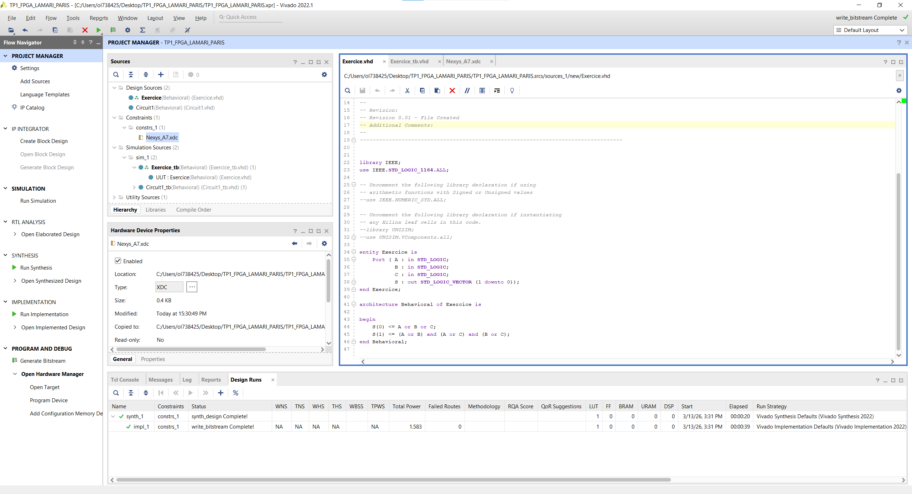
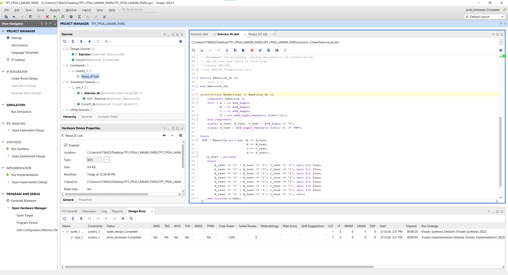
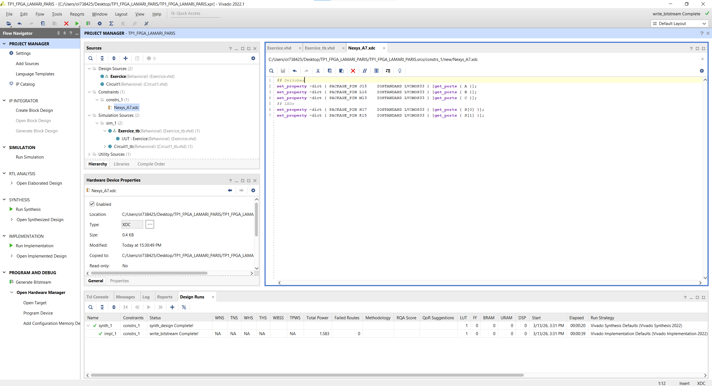
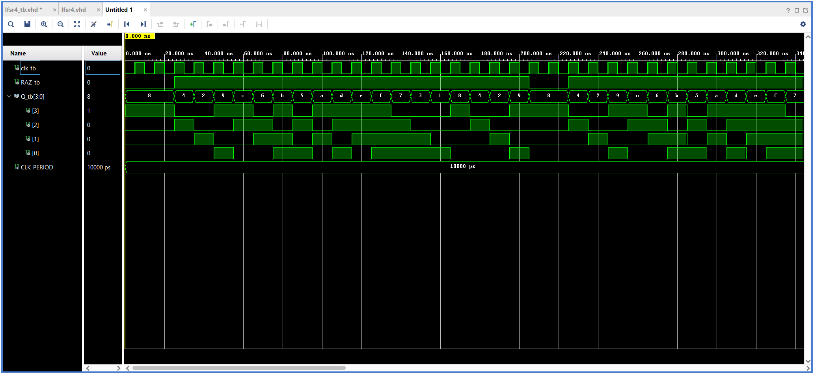

# Travaux Pratiques FPGA/VHDL - M1 ESI/EEA

<div align="center">


</div>

---

**Auteurs :** Omar Lamari & Alexis Paris  
**Établissement :** Université de Bourgogne Europe  
**Filière :** M1 ESI/EEA - 2025/2026  
**Outil :** Vivado 2022.1 | **Carte cible :** Nexys A7-100T (Artix-7 XC7A100T)  

---

## Rapport et énoncé

- [Télécharger le rapport complet (PDF)](rapport/Rapport_TPs_FPGA_LAMARI_PARIS.pdf)
- [Télécharger l'énoncé officiel (PDF)](rapport/Enonce_TPs_FPGA_VHDL.pdf)

---

## Contenu du projet

| TP | Thème | Composants VHDL |
|----|-------|-----------------|
| **TP 1** | Logique combinatoire | `Circuit1.vhd`, `Exercice.vhd` |
| **TP 2** | Filtre anti-rebond (debounce) | `TP2.vhd`, `main.vhd` |
| **TP 3 - P1** | Codeur 7 segments | `Codeur_7Seg.vhd` |
| **TP 3 - P2** | Compteur modulo 10 + affichage | `compteur_mod10.vhd`, `div_freq.vhd`, `count_affich.vhd` |
| **TP 3 - P3** | LFSR 4 bits (registre à décalage) | `lfsr4.vhd` |
| **TP 3 - P4** | Minuterie avec affichage 7 seg | `minuterie_top.vhd` |
| **TP 5** | Machine d'états finie (FSM distributeur) | `machine_etats_top.vhd` |

---

## Détail des TPs

### TP 1 - Logique combinatoire

Conception et simulation de circuits combinatoires en VHDL.

- `Circuit1.vhd` - Premier circuit combinatoire (portes logiques, multiplexeurs)
- `Exercice.vhd` - Circuit d'exercice principal
- Testbenches : `Circuit1_tb.vhd`, `Exercice_tb.vhd`
- Contraintes pin : `Nexys_A7.xdc` (switchs, LEDs)

**Captures de simulation :**

| Code VHD | Testbench | Simulation | Contraintes XDC |
|----------|-----------|------------|-----------------|
|  |  |  |  |

---

### TP 2 - Filtre anti-rebond (Debounce)

Implémentation d'un filtre anti-rebond matériel pour les boutons poussoirs de la Nexys A7.

- `TP2.vhd` - Filtre anti-rebond (compteur + registre à décalage)
- `main.vhd` - Top-level instanciant le filtre sur la carte
- `filtre_anti_rebond_tb.vhd` - Testbench avec stimuli bouton
- `TP2.xdc` - Mapping boutons et LEDs

---

### TP 3 - Afficheur 7 segments, Compteur, LFSR, Minuterie

Projet progressif en 4 parties autour des afficheurs 7 segments et des circuits séquentiels.

#### Partie 1 - Codeur 7 segments
- `Codeur_7Seg.vhd` - Décodeur BCD vers 7 segments (affichage d'un digit 0-9)
- `Codeur_7Seg.xdc` - Contraintes d'affichage sur les 7 segments de la Nexys A7

#### Partie 2 - Compteur modulo 10 avec affichage
Architecture hiérarchique multi-composants :

```
count_affich (top)
├── compteur_mod10   - Compteur 0 à 9 avec reset
├── div_freq         - Diviseur de fréquence (100 MHz vers 1 Hz)
└── codeur_7seg      - Affichage du résultat sur 7 segments
```

- `compteur_mod10_tb.vhd` - Testbench du compteur
- `TP3.xdc` - Horloge, bouton reset, afficheur

#### Partie 3 - LFSR 4 bits



- `lfsr4.vhd` - Registre à décalage à rétroaction linéaire 4 bits (séquence pseudo-aléatoire)
- `lfsr4_tb.vhd` - Vérification de la séquence pseudo-aléatoire complète (15 états)

#### Partie 4 - Minuterie
- `minuterie_top.vhd` - Minuterie complète avec affichage 2 chiffres sur 7 segments (secondes + dizaines)
- `minuterie_tb.vhd` - Testbench de la minuterie
- `tp3_exo3.xdc` - Horloge, reset, enable, afficheur double chiffre

---

### TP 5 - Machine d'états finie (FSM - Distributeur)

Conception d'une FSM de type Moore modélisant un distributeur automatique de boissons.

```
États : ATTENTE -> INSERTION_50 -> INSERTION_100 -> DISTRIBUTION -> RENDU_MONNAIE -> ATTENTE
```

- `machine_etats_top.vhd` - FSM complète avec gestion des états, transitions et sorties
- `machine_etats_top_tb.vhd` - Testbench simulant les séquences d'insertion de pièces
- `TP5.xdc` - Boutons (pièces), LEDs (état), afficheur

---

## Structure du dépôt

```
Tps-FPGA-VHDL-M1-EEA-TSI/
│
├── README.md
├── .gitignore
│
├── rapport/
│   ├── Rapport_TPs_FPGA_LAMARI_PARIS.pdf   <- Rapport complet
│   └── Enonce_TPs_FPGA_VHDL.pdf            <- Énoncé officiel
│
├── TP1_logique_combinatoire/
│   ├── src/            Circuit1.vhd, Exercice.vhd
│   ├── sim/            Circuit1_tb.vhd, Exercice_tb.vhd
│   ├── constraints/    Nexys_A7.xdc
│   └── captures/       Screenshots Vivado
│
├── TP2_filtre_anti_rebond/
│   ├── src/            TP2.vhd, main.vhd
│   ├── sim/            filtre_anti_rebond_tb.vhd
│   └── constraints/    TP2.xdc
│
├── TP3_afficheur_compteur_LFSR/
│   ├── Partie1_codeur_7seg/
│   ├── Partie2_compteur_mod10/
│   ├── Partie3_LFSR/
│   └── Partie4_minuterie/
│
└── TP5_machine_etats_FSM/
    ├── src/            machine_etats_top.vhd
    ├── sim/            machine_etats_top_tb.vhd
    └── constraints/    TP5.xdc
```

---

## Utilisation dans Vivado

1. Ouvrir **Vivado 2022.1**
2. **File -> New Project** -> pointer vers le dossier du TP souhaité
3. Ajouter les fichiers `src/*.vhd` comme **Design Sources**
4. Ajouter les fichiers `sim/*.vhd` comme **Simulation Sources**
5. Ajouter le fichier `constraints/*.xdc` comme **Constraints**
6. Cible : `xc7a100tcsg324-1` (Nexys A7-100T)
7. **Run Simulation** -> **Run Synthesis** -> **Run Implementation** -> **Generate Bitstream**
